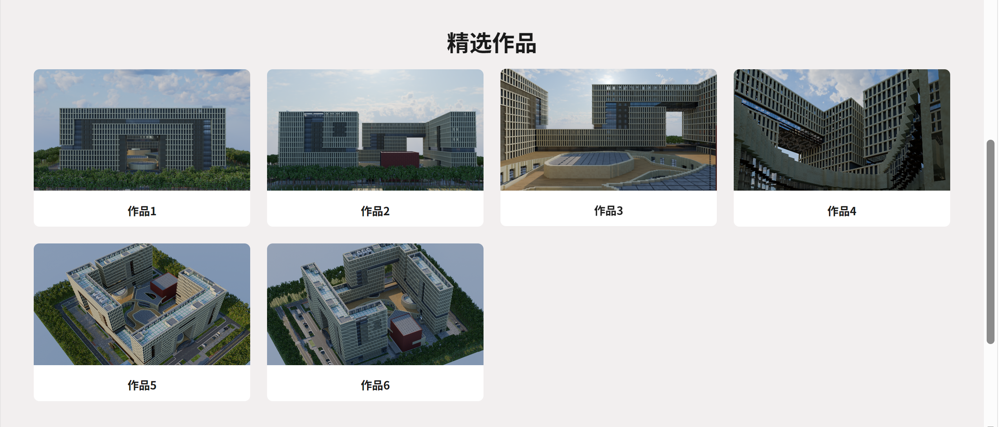

# XXX家园 · Minecraft 建筑作品集

> 这是我学习前端过程中的练习项目，用于展示个人 Minecraft 建筑作品。

一个展示 Minecraft 建筑作品的个人画廊，使用 Blender 渲染图呈现。

## 预览




## 技术栈

- **HTML5** — 语义化标签，文档布局
- **CSS3** — Flexbox、Grid、CSS 变量、媒体查询、伪元素

## 项目结构

```
project
├── index.html
├── styles.css
├── assets
│   ├── data
│   ├── images
│   └── ...
└── README.md
```

## 本地运行

1. 克隆或下载本项目
2. 用浏览器直接打开 `index.html`
3. 或者用 VS Code 的 Live Server 扩展启动本地预览

## 计划

- [ ] 使用JavaScript为网页添加交互功能
- [ ] 作品集页（20–30 个作品，支持分类筛选）
- [ ] 作品详情页（大图、说明、版本、光影信息）
- [ ] 用 JSON 数据驱动作品列表
- [ ] 图片懒加载与响应式优化