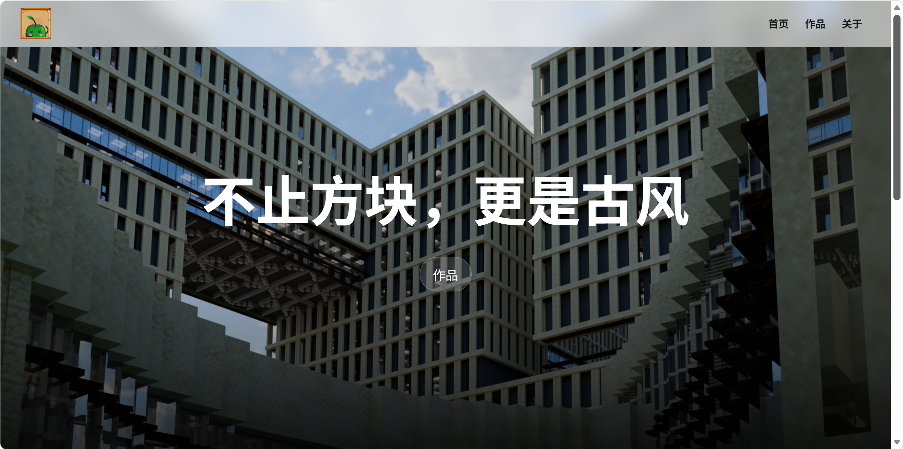
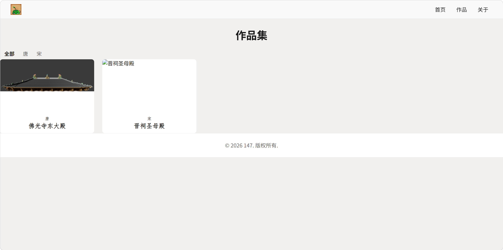
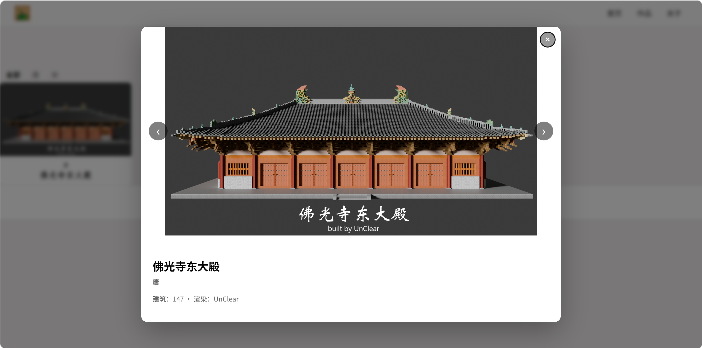

# 147家园 · Minecraft 建筑作品集

> 这是我学习前端过程中的练习项目，用于展示个人 Minecraft 建筑作品。


一个展示 Minecraft 建筑作品的个人画廊，使用 Blender 渲染图呈现。

## 在线预览

[https://unc1ear.cn/portfolio-display/](https://unc1ear.cn/portfolio-display/)

## 预览

*首页大图*

*首页精选*

*作品集页*

*作品详情*


## 技术栈

- **HTML5** — 语义化标签，文档布局
- **CSS3** — Flexbox，Grid，CSS 变量，媒体查询，伪元素,过渡动画
- **JavaScript** — 原生 JS,fetch,DOM 操作,事件委托,模板字符串
- **GitHub Actions** — 持续部署

## 项目结构

```
project
├── index.html
├── portfolio.html
├── styles/
│   ├── index-styles.css
│   └── portfolio-styles.css
├── js/
│   ├── main.js
│   └── portfolio.js
├── assets/
│   ├── data/
│   │   └── selected-works.json
│   └── images/
├── .github/
│   └── workflows/
│       └── deploy.yml
└── README.md
```

## 本地运行

1. 克隆或下载本项目
2. 用 VS Code 的 Live Server 启动本地服务器
3. 浏览器访问 `http://127.0.0.1:5500/`

> 注意：不能直接双击打开 `index.html`。项目用 `fetch` 读取 JSON 数据，`file://` 协议下会被浏览器跨域限制阻止。

## 部署

项目部署在腾讯云服务器上，使用 Nginx 提供服务，GitHub Actions 自动部署。

每次 `git push` 到 `main` 分支，会自动触发 [deploy.yml](.github/workflows/deploy.yml)，将文件同步到服务器。

## 计划

- [x] 首页
- [x] 作品集页（朝代筛选）
- [x] 详情弹窗（图片轮播）
- [x] 数据驱动（JSON + fetch）
- [x] 部署上线
- [ ] 补充真实作品数据
- [ ] 移动端优化
- [ ] 键盘可访问性